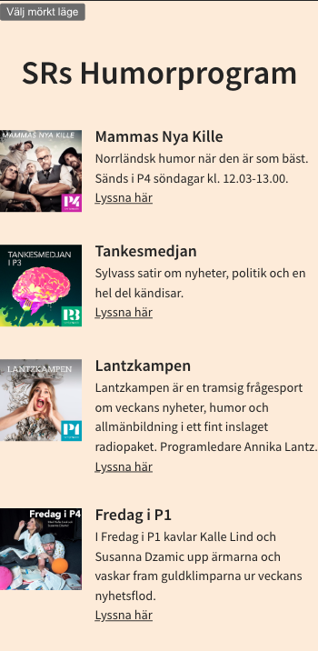
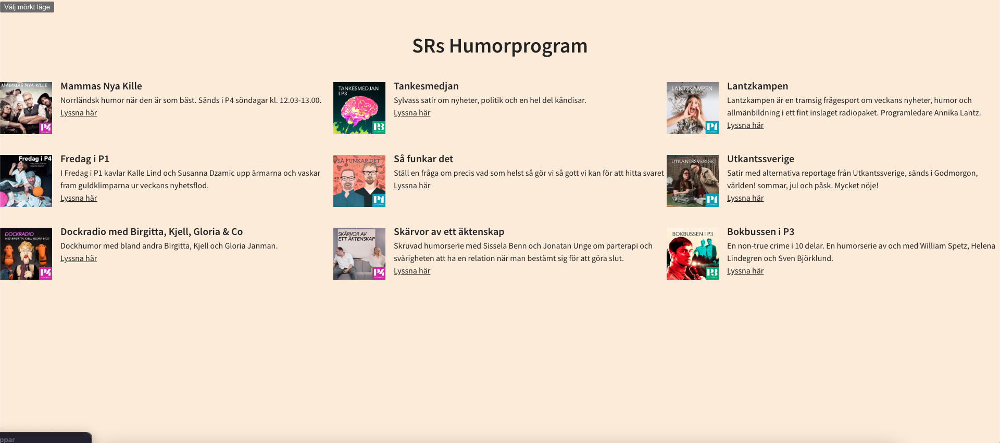
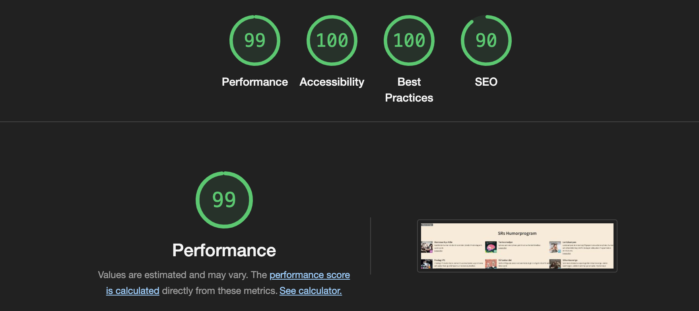

# SRs Humorprogram :fire:

---

Mammas nya kille, Så funkar det eller Lantzkampen? Valet är ditt! SRs Humorprogram samlar poddar inom segmentet Humor och låter användaren kunna klicka sig vidare för att lyssa på sin favoritpodd. Enjoy!

## Look and feel :art:

---

### Mobile first (ofc!)



### And then there is.. desktop (woop woop!)



### Tekniker :bulb:

---

- Vite.js
- Typescript
- SASS
- Axios
- ESLint

### Kom igång

---

1. Klona projektets repo genom att köra följande kommando i din terminal:

   ```bash
   git clone https://github.com/Medieinstitutet/inlamningsuppgift-1-sannarossang.git
   ```

2. Navigera till rätt mapp i din terminal

   ```bash
   cd inlamningsuppgift-1-sanna-rossang
   ```

3. Installera npm-paket som behövs för projektet

```bash
npm install
```

4. Kör igång projektet

```bash
npm run dev
```

---

### Tillgänglighetsgranskning/Lighthouse



I min Lighthouse-analys fick jag nedslag på att det saknades en metabeskrivning för sidan, så jag la till det. 
I tillgänglighetsgranskningen fick jag inte fram några fel. 

---

### Betygsunderlag :technologist:

---

G

- [x] En färdig uppgift markeras med ett x. Du kan radera denna exempelrad.
- [x] Få projektet att funka
- [x] CSS till Sass
- [x] Enhetlig namngivning i CSS:en
- [x] Konvertera till TypeScript
- [x] Enhetlig kodkvalitet
- [x] Mobilvyn
- [x] Språk
- [/->VG-delen] Rensa loggning
- [x] Dokumentation
- [x] Tillgänglighet (bilder)
- [x] Refaktorera funktioner
- [x] Eliminera onödig kod
- [x] Rensa bort kod som inte ska sättas

VG

- [x] Rätt sak på rätt plats
- [x] Hantera loggning på ett effektivt sätt
- [x] Gör en tillgänglighetsgranskning av sidan
- [x] Utnyttja features i Sass i CSS:en
- [x] Rensa bort paket som inte används
- [x] Hantera fel i API-anropet
- [x] Gör en Lighthouse-analys
- [ ] Läs av utvecklingsmiljön
- [x] Enhetlig syntax i CSS:en
- [ ] Publicera sidan på GitHub pages
